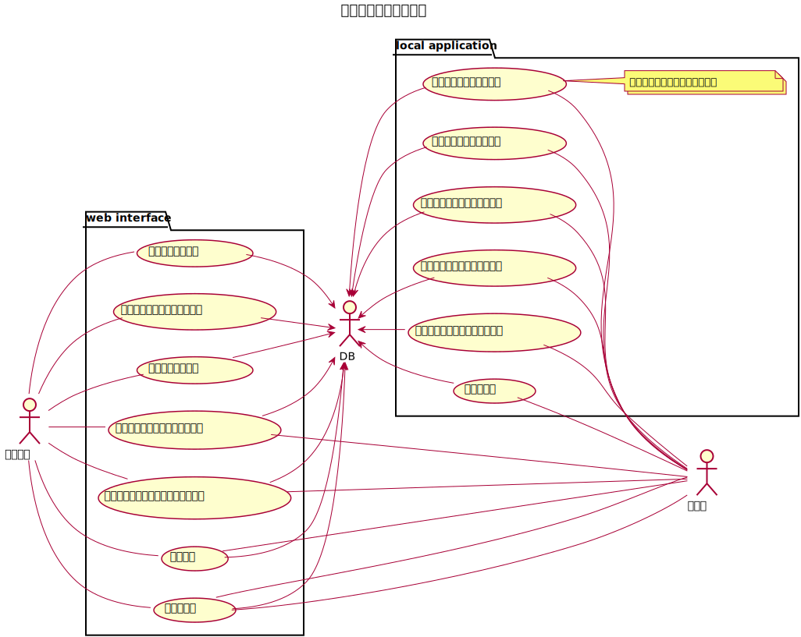

= PlantUMLによる設計。
:toc: left
:toc-title: 目次
:auther: 中島慎児
:source-highlighter: coderay

== はじめに

PlantUMLによる設計を簡単な例題をもとに説明します。 +
大雑把な目標は、UMLでどんなことが表現できるか、簡単なUMLを書きながら説明することです。 +
用語の内容やPlantUMLの詳細な文法にはあまり触れません。適宜、適当なURLを示すことで代替します。 +

== 開発環境

== ユースケース

ユースケースとは、ひとことでいうと表現力豊かな箇条書きです。 +

== クラス図
== 画面設計
== 画面遷移
== システム構成
== 終わりに
