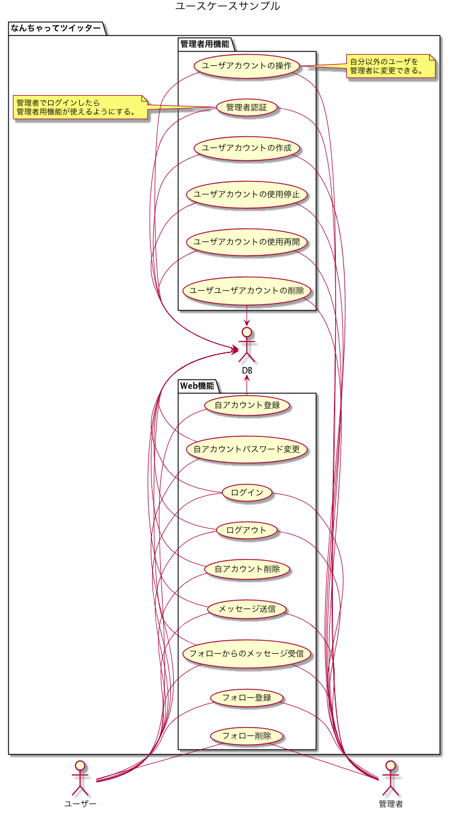
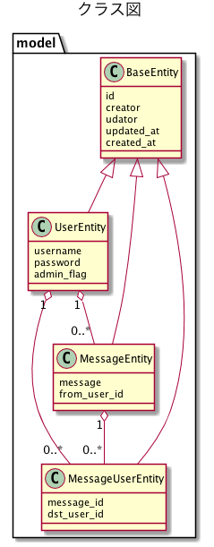

= PlantUMLによる設計。
:toc: left
:toc-title: 目次
:auther: 中島慎児
:source-highlighter: coderay

== はじめに

PlantUMLによる設計を簡単な例題をもとに説明します。 +
大雑把な目標は、UMLでどんなことが表現できるか、簡単なUMLを書きながら説明することです。 +
用語の内容やPlantUMLの詳細な文法にはあまり触れません。適宜、適当なURLを示すことで代替します。 +

さて、これから作るのは、いわば「なんちゃってツイッター」です。 +
要件は以下の通り。 +

. ユーザは自由に自分のアカウントを作れます。 +
. ユーザは自分のアカウントを削除できます。 +
. ユーザは相手のアカウントがわかっていれば、別のユーザにメッセージを送信できます。 +
. 自分宛てに送信されたメッセージを閲覧できます。 +
. ユーザの中には管理者がいます。 +
. 管理者は、一般ユーザを利用停止したり削除したりできます。 +
. 管理者はユーザを管理者にしたり、管理者をユーザにもどしたりできます。 +

また、最初の管理者はデータベースに直接用意することにしましょう。 +
まったく実用にはほど遠いですが、これで良しとしましょう。してください。 +

== 開発環境

開発環境は、というか、UMLを書くためのマシンは、どうしてもWindowsが中心ならざるを得ません。 +
WindowsにおけるUMLの記述方法はいくつかあります。 +

* astahなどを使う。
* ドロー系ソフトを使う
  ** Excel
  ** PowerPoint
* PlantUMLを使う

=== PlantUMLを使えるようにする。

WindowsでPlantUMLを使えるようにするには…

== ユースケース

ユースケースとは、ひとことでいうと表現力豊かな箇条書きです。 +

== 画面設計

画面設計は意外と工数のかかる作業です。 +
本来のUMLには画面設計にあたるドキュメントはありませんが、簡単な業務システムならば、PlantUMLで設計することが可能です。 +

== 画面遷移

それぞれの見た目を画面設計で作った後、または作ると同時に、画面遷移も決めていかなけらばなりません。 +
これをUMLで表現する場合は、ロバストネス図というものを作ります。 +

== クラス図

外側を大まかに決めたら、次は中身を決めていきます。 +

== シーケンス図

それぞれのクラスが、どのように相互座用をするか記述するのがシーケンス図です。 +

== ステート図

== システム構成

いまどきのシステム開発は、末端の下っ端プログラマーもシステムの全体像を意識しないと仕事ができません。 +

== 終わりに

PlantUMLの最大の利点は、ドキュメント更新の速さです。 +
この線をあと1ドットずらしてくれ、ここのフォントを小さくしてくれなど、見た目にしか影響がなくロジックの表現はいっさい貢献しない部分に工数を咲く必要がないのです。 +
