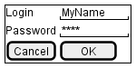
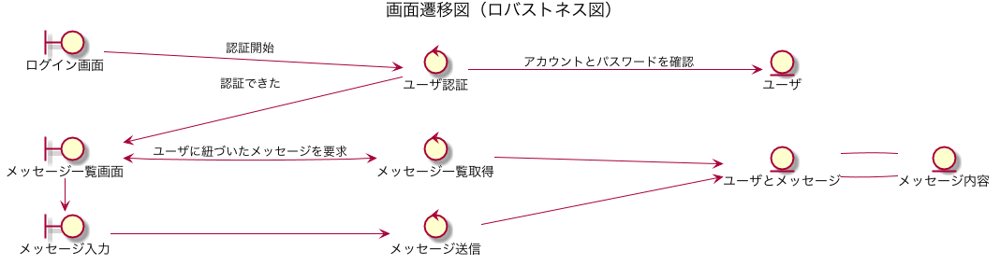

= PlantUMLによる設計。
:toc: left
:toc-title: 目次
:auther: 中島慎児
:source-highlighter: coderay

PlantUMLによる設計を簡単な例題をもとに説明します。 +

== はじめに

大雑把な目標は、UMLでどんなことが表現できるか、実際に簡単なUMLを書きながら説明することです。 +
用語の内容やPlantUMLの詳細な文法にはあまり触れません。適宜、適当なURLを示すことで代替します。 +

さて、これから作るのは、いわば「なんちゃってツイッター」です。 +
要件は以下の通り。 +

. ユーザは自由に自分のアカウントを作れます。 +
. ユーザは自分のアカウントを削除できます。 +
. ユーザは相手のアカウントがわかっていれば、フォローとして登録できます。 +
. ユーザは、フォローが送信したメッセージを一覧表示できます。 +
. ユーザはメッセージを送信できます（そのユーザをフォローとして登録した人はメッセージを閲覧できます）。 +
. ユーザの中には管理者がいます。 +
. 管理者は、一般ユーザを利用停止したり削除したりできます。 +
. 管理者はユーザを管理者にしたり、管理者をユーザにもどしたりできます。 +

また、最初の管理者はデータベースに直接用意することにしましょう。 +
まったく実用にはほど遠いですが、これで良しとしましょう。してください。 +

== 開発環境

開発環境は、というか、UMLを書くためのマシンは、どうしてもWindowsが中心ならざるを得ません。 +
WindowsにおけるUMLの記述方法はいくつかあります。 +

* astahを使う。
* ドロー系の機能を持ったソフトを使う
  ** Excel
  ** PowerPoint
* PlantUMLを使う

それぞれ一長一短があります。 +
link:http://astah.change-vision.com/ja/product/astah-community.html[astah]はとても優秀なアプリケーションですが、Community版は商用利用ができないなど若干の枷があります。 +
図形をかける各種アプリケーションを使うのは、柔軟性は高いですが、まずもってUMLとはなんぞやといったあたりをクリアしないと作れません。 +
そこで登場するのがPlantUMLです。 +

=== PlantUMLを使えるようにする。

WindowsでPlantUMLを使えるようにするには…

* PlantUML本家
http://plantuml.com/

* 日本語の解説。インストールから例題まで。
http://yohshiy.blog.fc2.com/blog-entry-152.html

インストールに関しては、Chocolatey入れてからのほうが早いです。
* chocolatey
https://chocolatey.org/install
  choco install jdk8 -y
  choco install graphviz -y
  choco install plantuml -y

もともとのplantumlは、Javaでつくられたコマンドですが、ライブプレビューができる環境もあります。
検索するとAtomエディタでの例がたくさん出てきますが、Windows7、8だとプラグインの最近のVerでは
うまくいかないようです（Windows10ならうまくいきます）。

vscodeならプレビュー聞きますのでそっちで試してみてください。

* vscode
https://code.visualstudio.com/

* [Visual Studio Code][Windows]
PlantUMLの環境を設定する（シンタックスハイライト+リアルタイムプレビュー）
https://qiita.com/koara-local/items/e7a7a7d68a4f99a91ab1

== ユースケース

ユースケースとは、ひとことでいうと表現力豊かな箇条書きです。 +
image:uml/usecase.png[ユースケースサンプル]

----
include::uml/usecase.uml[ユースケース]
----

== 画面設計

画面設計は意外と工数のかかる作業です。 +
本来のUMLには画面設計にあたるドキュメントはありませんが、簡単な業務システムならば、PlantUMLで設計することが可能です。 +

たとえば、以下のようなログイン画面は… +
 +
このようなテキストで表現できます。 +
----
include::uml/salt/login.uml[login.uml]
----

== 画面遷移

それぞれの見た目を画面設計で作った後、または作ると同時に、画面遷移も決めていかなけらばなりません。 +
これをUMLで表現する場合は、ロバストネス図というものを作ります。 +

----
include::uml/screen_transition.uml[画面遷移図]
----

== クラス図

外側を大まかに決めたら、次は中身を決めていきます。 +
image:uml/class_diagram.png[クラス図]

== 終わりに

PlantUMLの最大の利点は、ドキュメント更新の速さです。 +
その秘密は、実は、柔軟性のなさにあります。繰り返します。柔軟性のなさです。 +
この線をあと1ドットずらしてくれ、ここのフォントを小さくしてくれなど、見た目にしか影響がなくロジックの表現はいっさい貢献しない部分に工数を割く必要はないのです。 +
